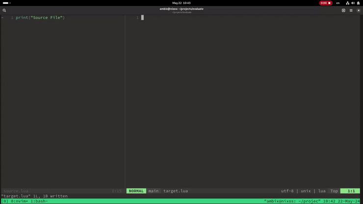

# EvaLUAte
A neovim script for comparing lua source to lua bytecode.

# Dependencies 
You just need luac.

# Setup
Open a file called source.lua in this projects directory. In neovim source `auto.lua` while in the desired bytecode buffer. Save when you want to compile and compare source to bytecode. 

